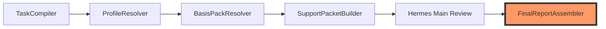

# hermes-review-agent: The Review Control Plane Shell

<p align="center">
  <strong>Engineering-grade governance shell for deterministic document review</strong>
</p>

<p align="center">
  <a href="https://github.com/watsonctl/hermes-review-agent/actions">
    
  </a>
  <a href="docs/README.md">
    
  </a>
</p>

## Manifesto: Why a "Shell"?

`hermes-review-agent` is not just a wrapper; it is a **Governed Control Plane**. 

Its mission is to provide a deterministic, fail-closed orchestrator around the **NousResearch/hermes-agent** kernel. We separate the "Thinking" (Kernel) from the "Governing" (Shell) to ensure that every review result is grounded in explicit evidence, standard registries, and formal acceptance rules.

### Core Philosophy
- **Smart Owner, Dumb Tools**: This repo owns the *Planet/Policy*, while adapters and kernels own the *Execution*.
- **Fail-Closed by Design**: If evidence is missing or the kernel degrades, the shell refuses to emit a formal report.
- **DeepSeek Primary**: Optimized for DeepSeek's specific reasoning patterns for high-recall issue detection.

---

## Architectural Topology

The repository operates as a **Governance Shell** protecting the **Upstream Kernel**.

```text
[ External Caller / Web UI ]
            |
            v
+-------------------------------------------------------+
| hermes-review-agent (Local Shell / Control Plane)     |
|                                                       |
|   - Task Governance & Basis Selection                 |
|   - Evidence Synthesis & Result Assembly              |
|   - Fail-Closed Safety Gates                          |
|                                                       |
|  +-------------------------------------------------+  |
|  | external/hermes-agent (Upstream Kernel)         |  |
|  |   - Judgment Engine & Reasoning                 |  |
|  +-------------------------------------------------+  |
|                                                       |
+-------------------------------------------------------+
```

---

## The Governed Review Pipeline

All formal reviews follow this strict, audited execution chain:



1. **TaskCompiler**: Normalizes raw inputs into a strict `ReviewBrief`.
2. **ProfileResolver**: Determines the system classification and governance profile.
3. **BasisPackResolver**: Assembles laws, standards, and rule sets based on the profile.
4. **SupportPacketBuilder**: Prepares the visibility gaps and evidence pointers.
5. **Hermes Main Review**: Executes the judgment using the reasoning kernel.
6. **FinalReportAssembler**: The **ONLY** official exit point for synthesized reports.

---

## Quick Start

### 1. Setup Environment
```bash
make bootstrap
```

### 2. Launch Local Control Plane
```bash
make dev
```

### 3. Execute Evaluation Suite
```bash
make eval-review
```

---

## Documentation Index

The **Source of Truth** for all governance and design resides in the `docs/` hierarchy.

| Layer | Content | Focus |
|---|---|---|
| [00-Product](docs/00-product/) | Landscape & Strategy | "What & Why" |
| [10-Governance](docs/10-governance/) | Capability Boundaries & Spec | "Rules & Gates" |
| [20-Design](docs/20-design/) | Architecture & Modules | "How it works" |
| [30-Quality](docs/30-quality/) | Testing & Limitations | "Validation" |
| [40-Operations](docs/40-operations/) | Runbooks & Deployment | "Maintenance" |

> For a detailed layer-by-layer definition including frozen and legacy code paths, see [docs/20-design/layer-governance.md](docs/20-design/layer-governance.md).

---

## Repository Governance

This project follows the **Harness Engineering** governance model. All technical decisions and execution rules are codified in:
- `[[AGENTS.md]]`: The local execution contract for AI agents and human contributors.
- `[[REPO_CATALOG.md]]`: System-level repository mapping.

---

## License

MIT © 2026 [watsonctl](https://github.com/watsonctl)

---

<p align="center">
  <sub>Publish the framework, govern the memory, trust the evidence.</sub>
</p>
