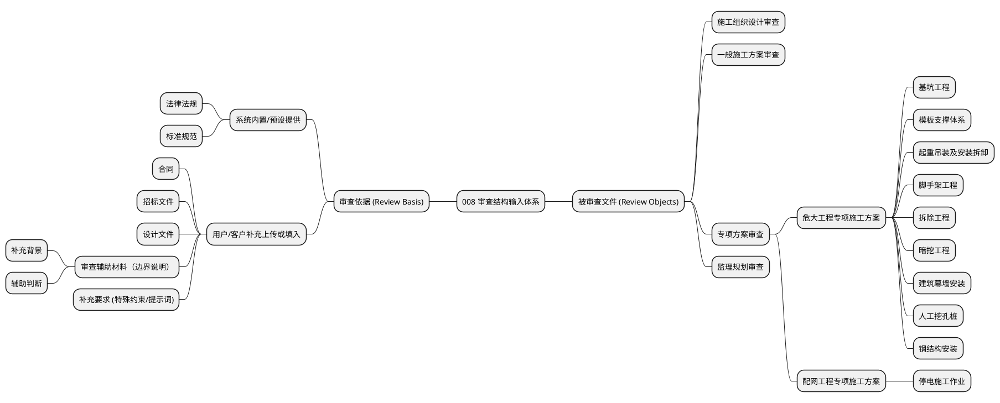

> [!NOTE]
> **本文档职责**
> - 负责：
>   - 说明 review 相关核心对象、结构关系、问题项体系与结构化审查总览
> - 不负责：
>   - 不替代系统架构文档
>   - 不替代 V1 产品定义、边界声明与验收口径
> - 主适用读者：
>   - 产品经理、架构师、研发工程师、评审人员
> - 冲突处理：
>   - 涉及最终契约与实现细节时，以 design / governance 对应主文档为准
> - 文档状态：
>   - 结构总览文档

---

# 008 审查结构与专项施工方案目录要求

本文档用于展示当前 008 产品的审查结构口径，面向产品、方案与审查口径对齐场景。

本文仅描述产品审查结构与目录要求，不涉及代码实现，不涉及技术架构。

## 一、审查体系与层级总览

整个 008 系统的审查输入主要分为**审查依据**和**被审查文件**两大类。被审查文件具有明确的层级结构。

### 1.1 审查依据（Review Basis）
审查依据是系统进行合规与风险判断的标准和基线，按来源分为两类：

**系统内置/预设提供：**
- **法律法规**：国家及地方相关的工程建设法律、行政法规。
- **标准规范**：国家标准（GB）、行业标准（JGJ等）、地方标准及企业标准。

**用户/客户补充上传或填入：**
- **合同**：工程总承包合同、施工合同、监理合同及其附件等。
- **招标文件**：项目发包期的招标文件及技术要求。
- **设计文件**：施工图纸、设计说明、设计变更及地勘报告等。
- **审查辅助材料（边界说明）**：
  - 补充背景
  - 辅助判断（不替代正式正文）
- **补充要求**：由客户自行填入或上传的补充提示词、特殊约束等。

### 1.2 被审查文件结构（Review Objects - 三级层级）
被审查文件构成了核心审查对象的主树，严格分为三个层级：
- **一级（入口与基础文件层）**：
  - 施工组织设计
  - 一般施工方案
  - 专项方案
  - 监理规划
- **二级（专项大类层，归属于一级专项方案）**：
  - 危大工程专项施工方案
  - 配网工程专项施工方案
- **三级（具体专项场景层，归属于二级大类）**：
  - 危大工程包含：基坑工程、模板支撑体系、起重吊装及安装拆卸、脚手架工程、拆除工程、暗挖工程、建筑幕墙安装、人工挖孔桩、钢结构安装等。
  - 配网工程包含：停电施工作业等。

---

## 二、被审查文件节点详情总览

```text
被审查文件结构（主树）
│
├─ 施工组织设计审查
│  ├─ 核心章节完整性
│  ├─ 专项方案挂接
│  └─ 附件 / 图纸可视域
│
├─ 一般施工方案审查
│  ├─ 最小核心结构
│  ├─ 附件 / 图纸可视域
│  └─ 场景风险补充检查
│
├─ 专项方案审查
│  ├─ 危大工程专项施工方案
│  └─ 配网工程专项施工方案
│
└─ 监理规划审查
   ├─ 核心章节完整性
   ├─ 监测监控 / 旁站 / 巡视
   └─ 附件 / 图纸可视域
```

## 三、专项方案审查三级结构

```text
专项方案审查（一级）
│
├─ 危大工程专项施工方案（二级）
│  ├─ 基坑工程（三级）
│  ├─ 模板支撑体系（三级）
│  ├─ 起重吊装及安装拆卸（三级）
│  ├─ 脚手架工程（三级）
│  ├─ 拆除工程（三级）
│  ├─ 暗挖工程（三级）
│  ├─ 建筑幕墙安装（三级）
│  ├─ 人工挖孔桩（三级）
│  └─ 钢结构安装（三级）
│
└─ 配网工程专项施工方案（二级）
   └─ 停电施工作业（三级）
```

## 四、专项施工方案通用目录要求

```text
专项施工方案
│
├─ 1. 工程概况
├─ 2. 编制依据
├─ 3. 施工计划
├─ 4. 施工工艺技术
├─ 5. 施工保证措施
├─ 6. 施工管理及作业人员配备和分工
├─ 7. 验收要求
├─ 8. 应急处置措施
├─ 9. 相关施工图纸 / 节点详图 / 布置图
├─ 10. 风险辨识与分级
├─ 11. 施工平面布置或周边环境条件
└─ 12. 计算书及相关验算依据
```

## 五、三级专项补充目录要求

### 5.1 基坑工程
- 支护、降水、开挖及加撑关系
- 监测监控措施
- 周边环境与监测点相关图纸
- 验收要求

### 5.2 模板支撑体系
- 技术参数
- 工艺流程 / 浇筑顺序
- 计算依据
- 验收要求

### 5.3 起重吊装及安装拆卸
- 设备参数
- 吊装流程
- 安装拆卸顺序
- 站位承载依据
- 临时固定 / 辅助装置说明
- 站位图 / 平立面关系图 / 剖面图

### 5.4 脚手架工程
- 架体类型 / 高度 / 基础 / 主要构造参数
- 连墙件 / 附着支撑 / 防倾覆 / 防坠落装置
- 监测项目 / 控制值 / 验收要求

### 5.5 拆除工程
- 拆除顺序
- 解体清运流程
- 关键步序控制
- 保留结构 / 平台承载 / 稳定状态控制
- 临时支撑 / 吊运 / 爆破等计算依据

### 5.6 暗挖工程
- 地下水控制措施
- 注浆 / 冻结 / 水处理措施
- 开挖进尺 / 断面尺寸 / 支护参数
- 监测点布置图 / 周边环境平剖面图

### 5.7 建筑幕墙安装
- 安装操作设施
- 附着支座 / 动力设备 / 安全防护
- 运输路线 / 吊装运行路线
- 堆放平面布置
- 图纸及验收要求

### 5.8 人工挖孔桩
- 跳挖 / 分区分序要求
- 有害气体检测
- 防中毒窒息措施
- 防触电措施
- 禁用条件人工复核项

### 5.9 钢结构安装
- 构件参数
- 吊装设备选型
- 安装流程
- 拼装胎架 / 临时支撑 / 卸载条件
- 措施图纸及验收章节

### 5.10 停电施工作业
- 停电范围
- 作业内容
- 主要风险
- 施工人员
- 机具
- 材料
- 安全管控
- 质量管控
- 应急措施

## 六、横向附属检查模块

```text
横向附属检查模块（不进入主树三级）
│
├─ 临时用电 / 停送电
├─ 动火作业
├─ 煤气区域
└─ 起重吊装（横向风险）
```

## 七、口径说明

- **一级 / 二级 / 三级**：分别表示产品入口、专项方案大类、具体专项审查单元。
- **通用目录与专项补充目录**：所有专项施工方案先满足通用基础目录，再按具体三级专项补充专属目录要求。
- **横向附属模块**：用于补充风险检查，不等于三级专项，不进入专项方案主树层级。
- **审查依据的来源分离**：法律、国标等共识性较强的依据由系统内置或预设；具有强项目特异性的合同、图纸、招标文件、辅助材料及提示词由客户在审查前作为背景条件补充输入。

## 附录：PlantUML 源示例

> 仅供表达参考，正文以 Markdown 内可直接阅读的 ASCII 树和结构化标题为准。


