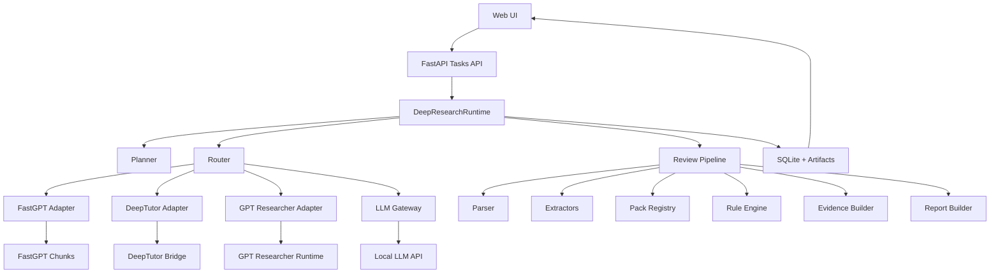

# 008 架构说明

## 为什么 008 是 control plane / orchestration 项目

因为它的职责不是承载某个具体审查 pack，而是：

- 统一接收任务
- 做任务规划与能力路由
- 编排 DeepTutor / GPT Researcher / FastGPT / 本地 LLM
- 保存任务状态、步骤、工件
- 向前端暴露统一、可观察的运行时接口
- 为正式审查能力提供可扩展的 review domain pipeline

## 双轨能力边界

- **`review_assist`**：快速辅助总结，明确不是正式结论。
- **`structured_review`**：正式结构化审查，输出稳定 schema、矩阵和报告工件。

runtime 仍然只是 orchestration / coordination 层；正式审查判断下沉到 `apps/api/src/review/`。

P0 当前，`structured_review` 的入口 profile 已显式化：

- `fixtureId` / `sourceDocumentRef`
- `documentType`
- `disciplineTags`
- `strictMode`
- `policyPackIds`

planner/router 只保留 provisional hints；最终生效值统一回写到 `result.resolvedProfile`，避免“用户指定 / 路由推断 / 实际执行”三套口径不一致。
`strictMode` 当前仅作兼容透传，状态为 `reserved / no-op`。
`result.visibility` 是结构化结果中的 top-level canonical visibility contract，并直接携带 `parseWarnings`；`summary.visibilitySummary` 仅保留为展示摘要。

## 分层

### 1. 前端层

路径：`/Users/lucas/repos/review/008-review-control-plane/apps/web`

职责：

- 展示平台定位与能力边界
- 创建任务
- 通过 SSE 实时流查看状态与步骤日志，断流时回退轮询
- 展示结果 / chunks / 引用 / 调试信息
- 对 `structured_review` 结果渲染 issues / matrices / report / reviewer decision

### 2. API 层

路径：`/Users/lucas/repos/review/008-review-control-plane/apps/api/src/routes`

职责：

- 任务创建、查询、结果查询、事件查询
- `support-scope` 与单文件 upload 入口
- artifact 列表与下载接口
- reviewer decision 更新接口
- health / capabilities / fixtures 暴露

### 3. Orchestrator 层（DeepResearchAgent 兼容层）

路径：

- `apps/api/src/orchestrator/planner.py`
- `apps/api/src/orchestrator/router.py`
- `apps/api/src/orchestrator/deepresearch_runtime.py`

职责：

- 生成 plan
- 选择能力
- 组织调用顺序
- 聚合最终结果
- 调度 `structured_review` 子域执行器

### 4. Review 子域

路径：`/Users/lucas/repos/review/008-review-control-plane/apps/api/src/review`

职责：

- 结构化文档解析（sections / blocks / tables / attachments / visibility）
- 事实抽取（project / hazard / schedule / resources / emergency）
- policy/evidence pack registry
- 规则命中（structure completeness / duplicate sections / attachment visibility / special scheme gap / schedule-resource pressure / hazardous special scheme checks）
- 证据归档（docEvidence / policyEvidence / evidenceMissing / manualReviewReason）
- 正式报告与矩阵构建
- evaluation harness / legacy + versioned golden case / ablations / cross-pack / cross-model 回归

### 5. Adapter 层

路径：`/Users/lucas/repos/review/008-review-control-plane/apps/api/src/adapters`

- `deeptutor_adapter.py`
- `gpt_researcher_adapter.py`
- `fastgpt_adapter.py`
- `llm_gateway.py`

职责：

- 把不同外部能力收束成统一接口
- 做配置注入、错误处理、响应归一化
- 在 formal review 中只作为工具层，不承担主裁判职责

### 6. Config 层

路径：`/Users/lucas/repos/review/008-review-control-plane/apps/api/src/config`

职责：

- 统一解析 LLM / FastGPT 配置
- 支持 env > 本地文件 回退
- 前端不直接接触密钥

### 7. State / Artifacts 层

- SQLite：`artifacts/tasks/runtime.sqlite`
- artifacts：`artifacts/tasks/<task-id>/...`
- uploads：`artifacts/uploads/<ref-id>/...`
- verification：`artifacts/verification/`
- review eval fixtures：`fixtures/review_eval/`

其中 artifact catalog 的单一事实源是：

- `result.artifactIndex`
- `GET /api/tasks/{taskId}/artifacts`

两者必须保持同口径，UI 不自行推导额外工件真相。

## 核心任务流

## 各能力角色

- **DeepResearchAgent / Runtime**：planner, router, coordinator
- **FastGPT**：底层知识切片检索层
- **DeepTutor**：知识问答 / 规范解释层
- **GPT Researcher**：研究报告 / 多来源归纳 / 本地文档研究层
- **LLM Gateway**：轻量整理、摘要、正式审查解释层（非主裁判）
- **Review Pipeline**：formal review 的领域执行器

## 当前 formal review 最小规则核

- 施工组织设计核心章节完整性
- 重复章节标题识别
- 附件可视域缺口标记
- 高风险作业专项方案挂接检查
- 应急预案针对性检查
- 停机窗口 / 人力 / 高风险工序并行压力提示
- 危大专项方案核心章节完整性
- 危大专项方案验算依据检查
- 危大专项方案措施-监测闭环检查

## P1 pack / evidence 体系

- `construction_org.base`（ready）
- `hazardous_special_scheme.base`（ready）
- placeholder base packs：
  - `construction_scheme.base`
  - `supervision_plan.base`
  - `review_support_material.base`
- scenario packs：
  - `lifting_operations.base`（ready）
  - `temporary_power.base`（ready）
  - `hot_work.base`（ready）
  - `gas_area_ops.base`
  - `special_equipment.base`
  - `working_at_height.base`

evidence packs 继续用 Python/Pydantic registry 管理，不进入 YAML/DSL 平台化。

## P0 评测门

- legacy CI 稳定子集：12 cases
- 本地完整评测池：26 cases
- versioned cases：6 cases，其中 3 个 official CI stage-gate cases
- 主指标：
  - `issue_recall`
  - `l1_hit_rate`
  - `high_severity_issue_recall`
  - `pack_selection_accuracy`
  - `policy_ref_accuracy`
  - `attachment_visibility_accuracy`
  - `severity_accuracy`
  - `manual_review_flag_accuracy`
  - `hard_evidence_accuracy`
  - `facts_accuracy`
  - `rule_hit_accuracy`
  - `hazard_identification_accuracy`

其中 `make eval-review` 的硬门禁分两层：

- legacy 主门禁：`issue_recall / l1_hit_rate / pack_selection_accuracy / policy_ref_accuracy / attachment_visibility_accuracy / severity_accuracy / manual_review_flag_accuracy`
- versioned official stage gate：`facts_accuracy / rule_hit_accuracy / hazard_identification_accuracy / attachment_visibility_accuracy / manual_review_flag_accuracy`

## 可扩展方向

- 增加更多 review pack registry
- 增加多文档批处理
- 增加更多专业场景 packs / evidence packs
- 增加多模态图纸/附件解析
