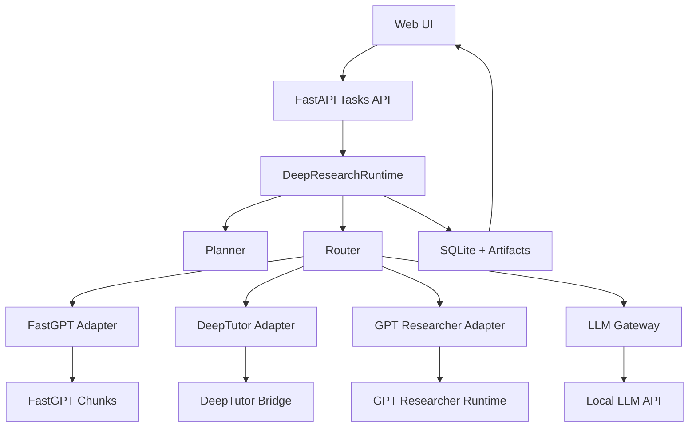

# 008 架构说明

## 为什么 008 是 control plane / orchestration 项目

因为它的职责不是承载某个具体审查 pack，而是：

- 统一接收任务
- 做任务规划与能力路由
- 编排 DeepTutor / GPT Researcher / FastGPT / 本地 LLM
- 保存任务状态、步骤、工件
- 向前端暴露统一、可观察的运行时接口

## 分层

### 1. 前端层

路径：`/Users/lucas/repos/review/008-review-control-plane/apps/web`

职责：

- 展示平台定位与能力边界
- 创建任务
- 轮询查看状态与步骤日志
- 展示结果 / chunks / 引用 / 调试信息

### 2. API 层

路径：`/Users/lucas/repos/review/008-review-control-plane/apps/api/src/routes`

职责：

- 任务创建、查询、结果查询、事件查询
- health / capabilities / fixtures 暴露

### 3. Orchestrator 层（DeepResearchAgent 兼容层）

路径：

- `apps/api/src/orchestrator/planner.py`
- `apps/api/src/orchestrator/router.py`
- `apps/api/src/orchestrator/deepresearch_runtime.py`

职责：

- 生成 plan
- 选择能力
- 组织调用顺序
- 聚合最终结果

### 4. Adapter 层

路径：`/Users/lucas/repos/review/008-review-control-plane/apps/api/src/adapters`

- `deeptutor_adapter.py`
- `gpt_researcher_adapter.py`
- `fastgpt_adapter.py`
- `llm_gateway.py`

职责：

- 把不同外部能力收束成统一接口
- 做配置注入、错误处理、响应归一化

### 5. Config 层

路径：`/Users/lucas/repos/review/008-review-control-plane/apps/api/src/config`

职责：

- 统一解析 LLM / FastGPT 配置
- 支持 env > 本地文件 回退
- 前端不直接接触密钥

### 6. State / Artifacts 层

- SQLite：`artifacts/tasks/runtime.sqlite`
- artifacts：`artifacts/tasks/<task-id>/...`
- verification：`artifacts/verification/`

## 核心任务流

## 各能力角色

- **DeepResearchAgent / Runtime**：planner, router, coordinator
- **FastGPT**：底层知识切片检索层
- **DeepTutor**：知识问答 / 规范解释层
- **GPT Researcher**：研究报告 / 多来源归纳 / 本地文档研究层
- **LLM Gateway**：轻量整理、摘要、最终辅助输出层

## 可扩展方向

- 增加正式 review pack registry
- 增加文档上传与多文档批处理
- 增加 SSE / websocket 实时日志流
- 增加多租户 dataset / collection 配置
- 增加审查规则执行器、结构化 issue schema、审查报告导出
