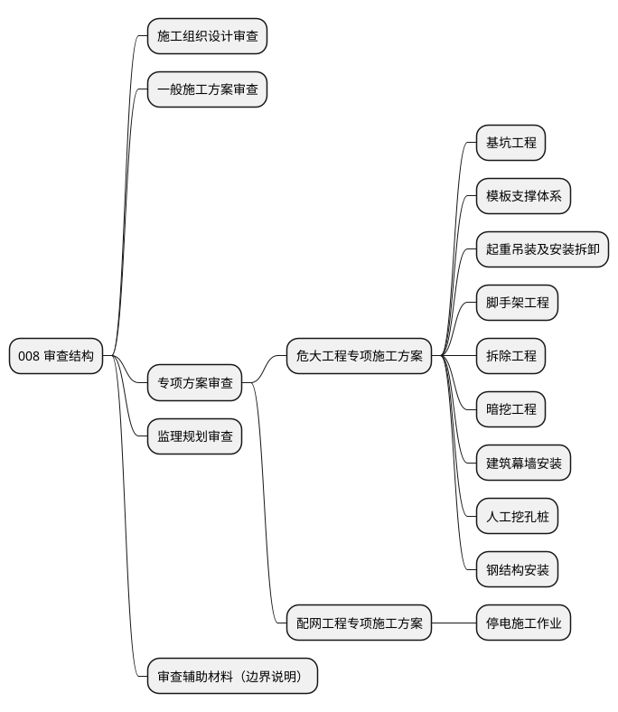

# 008 审查结构总览（ASCII 版）

> 说明：本文档用于展示当前 008 产品的审查结构口径，属于**产品审查结构图**，不涉及代码实现，不涉及技术架构。
>
> 当前口径来源：现有 support-scope、capability tree、pack 分层与正式审查类型定义。

## 审查结构总览

```text
008 审查结构
│
├─ 施工组织设计审查
│  ├─ 核心章节完整性
│  ├─ 高风险作业专项方案挂接
│  ├─ 附件 / 图纸可视域
│  └─ 资源、工序、窗口压力提示
│
├─ 一般施工方案审查
│  ├─ 最小核心结构完整性
│  ├─ 附件 / 图纸可视域
│  └─ 与场景风险相关的补充检查
│
├─ 专项方案审查
│  ├─ 危大工程专项施工方案
│  └─ 配网工程专项施工方案
│
├─ 监理规划审查
│  ├─ 核心章节完整性
│  ├─ 监测监控 / 旁站 / 巡视安排
│  └─ 附件 / 图纸可视域
│
└─ 审查辅助材料（边界说明）
   ├─ 仅作补充背景
   ├─ 可辅助判断
   └─ 不替代正式正文
```

## 专项方案审查三级结构

```text
专项方案审查（一级）
│
├─ 危大工程专项施工方案（二级）
│  │
│  ├─ 基坑工程（三级）
│  ├─ 模板支撑体系（三级）
│  ├─ 起重吊装及安装拆卸（三级）
│  ├─ 脚手架工程（三级）
│  ├─ 拆除工程（三级）
│  ├─ 暗挖工程（三级）
│  ├─ 建筑幕墙安装（三级）
│  ├─ 人工挖孔桩（三级）
│  └─ 钢结构安装（三级）
│
└─ 配网工程专项施工方案（二级）
   │
   └─ 停电施工作业（三级）
```

## 横向附属模块

```text
横向附属模块（不进入主树三级）
│
├─ 临时用电 / 停送电
├─ 动火作业
├─ 煤气区域
└─ 起重吊装（横向风险）
```

## 口径说明

- **一级**：产品能力入口。当前为“专项方案审查”。
- **二级**：方案大类，用来区分专项方案所属体系，例如“危大工程专项施工方案”“配网工程专项施工方案”。
- **三级**：具体专项审查单元，对应可挂载、可扩展、可独立表达的专项类型。
- **横向附属模块**：用于补充风险检查，不作为产品主树三级节点，不与具体专项并列展示。
- **施工组织设计 / 一般施工方案 / 监理规划**：保持主类展示，不展开为本页的三级专项树。
- **审查辅助材料**：只能补充背景与辅助判断，不能替代正式方案正文或监理规划正文。

## 附：可选 PlantUML 源示例

> 最终交付物以 Markdown 内可直接阅读的 ASCII 树为准；以下仅作为可选的结构表达示例。


